<p align="center" width="100%">
    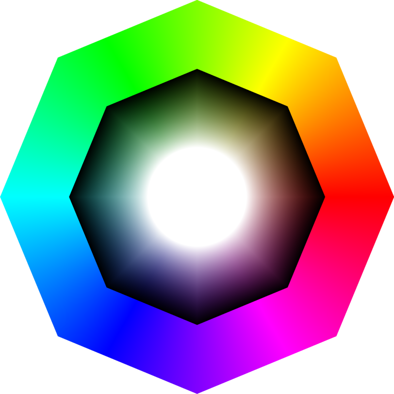
</p>

# In-Game Color Picker By Xenia

This is an in-game color picker designed to be used in Unity3D standalone projects.

<p align="center" width="100%">
    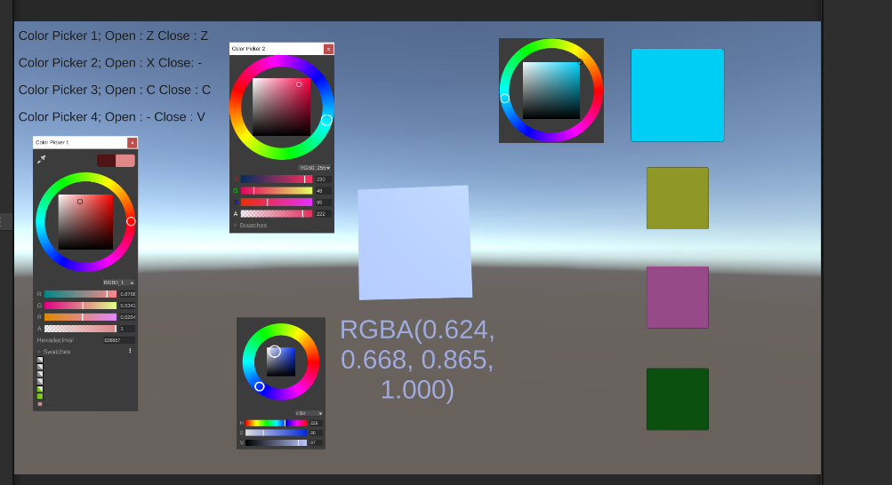
</p>

<p align="center" width="100%">
    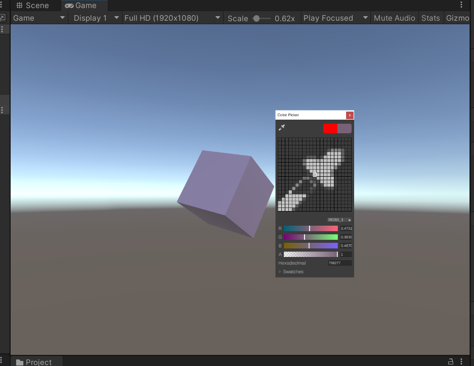
</p>

<p align="center" width="100%">
    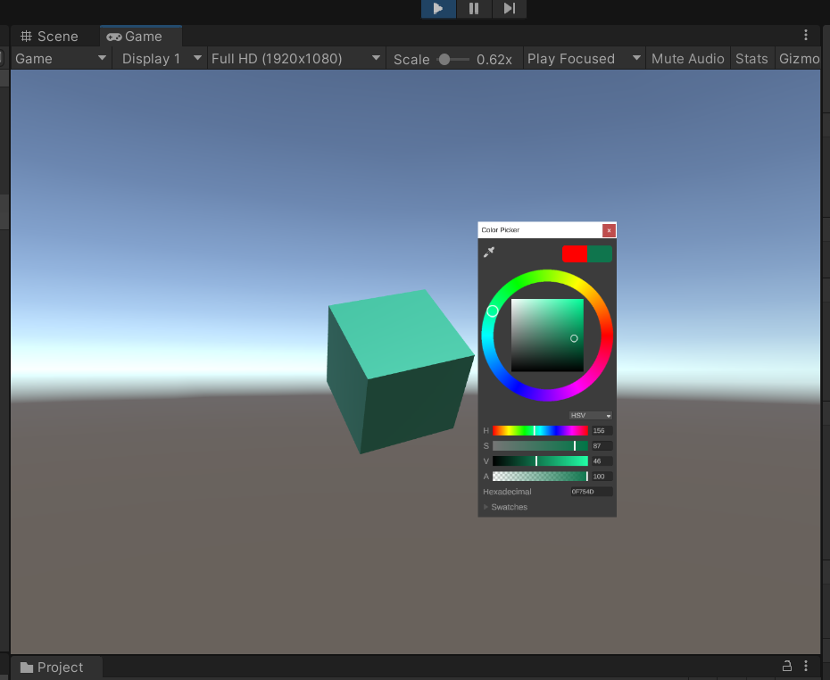
</p>

<p align="center" width="100%">
    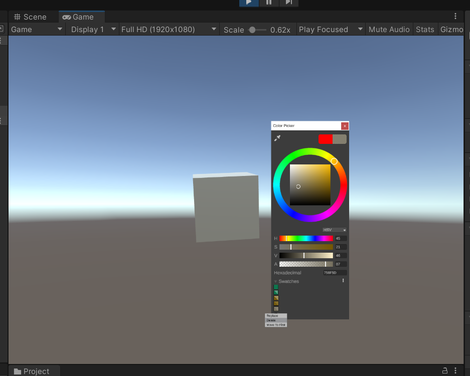
</p>

## Table Of Contents

* [License](#license)
* [Introduction](#introduction)
* [Features](#features)
* [Installation](#installation)
* [Usage](#usage)
* [Other Information](#other-information)
* [Authors](#authors)

## License

[](https://opensource.org/licenses/MIT)

## Introduction

Welcome to In-Game Color Picker By Xenia. This tool allows developers to easily implement a color picker within their Unity projects. It is designed to be flexible, and intuitive both for developers and players. Developers can easily add this tool to their projects, drop the prefab on their scenes and play with many customization options provided to them through a simple interface, without writing a single line of code or having to go through the color picker's hierarchy.

The GUI and certain features are inspired by and a replicate of the Unity's standard built-in color picker. And hence, the user interface is very intuitive and user-friendly with an added bonus of being customizable.

Note : It only works for Screen Space-Overlay for now

## Features

* GUI Features : 
    * Title text
    * Close button
    * Screen Color Picker for users to pick colors from their screen
    * Memory swatches one of which showing the previous color and retrieving it on click, and the other displaying the current color
    * Color Wheel that allows users to visually select colors from a circular color spectrum
    * RGB 0-255, RGB 0-1, and HSV modes, and a dropdown menu for switching between enabled modes
    * Sliders to display and change color depending on the color mode (either H, S, V or R, G, B)
    * Alpha slider for adjusting transparency
    * Input boxes to display and change color depending on the color mode (either H, S, V or R, G, B)
    * Hexadecimal input
    * Swatches menu that allows users to save and recall their favorite colors with vertical and grid display options
* Customization Options :
    * All of the GUI features mentioned above, except for the color wheel, can be removed from the UI or a combination of them can be used without breaking/distorting the UI
    * Option to make the color picker draggable in-game
    * Customizable texture size on sliders
    * Customizable size, and texture size on color wheel components
    * Customizable color on selector components (The ones that select color) of the color wheel
    * Customizable transparency on drawer components (The ones that draw textures) of the color wheel
    * Customizable thickness on circular components of the color wheel
    * Customizable color on many panels, texts throughout the UI
    * Option to start closed
    * Option to fire color events on opening
    * Option to serialize state (current color mode and current swatches layout)
    * Option to serialize position
    * Option to serialize color
    * Option to serialize serializable settings below (since these settings are serizalied, they can be added to a general settings menu to be changed by the player): 
        * Use Color Preview : Send preview events instead of color changed events when color changed, and send color changed events only when closed.
        * Adjust SV Selector Color Based On Brightness : Adjust the color of saturation-value selector based on the surface it's standing for better visibility
        * Draggable : Draggable via title and upper panels when turned on
        * Close Key Enabled and Close Key
        * Open Key Enabled and Open Key
        * Default Color : The default color before user interaction
* Other Features : 
    * ColorChanged, ColorPreview, Opening, and Closing unity events that can be subscribed through code or editor
    * GUI configurations and static settings can be saved by name and applied back again to the same or different color pickers
    * The color picker can always be brought back to the default layout (unless some parts are deleted)
    * Built-in serialization system (serialization options are mentioned above under the Customization) that supports multiple color pickers within a scene and/or across multiple scenes regardless of their names, tags, layers
    * Easily scalable without breaking/distorting the color picker

## Installation

1. Download the repository ZIP
2. Unzip the contents of the zip file
3. Delete images folder (optional)
4. Import everything to your Unity Project

Note : This tool has a dependency on TextMesh Pro, so it would be better to install it before installing this. I am sorry for the inconvenience, I am hoping to make this a UPM package soon

## Usage

After importing the color picker, you can either drag and drop the color picker prefab to your scene or right click in the hierarchy and click "Color Picker" to add one to your scene. Remember to add an EventSystem to your scene as well if it doesn't already have one.


<p align="left" width="100%">
    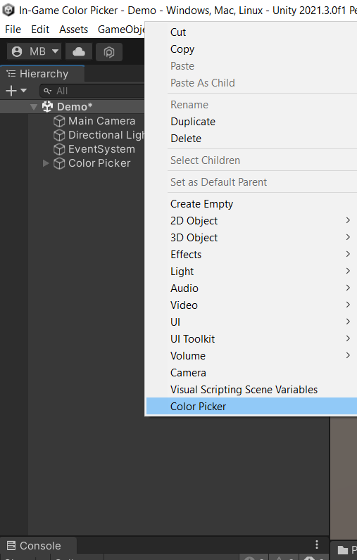
</p>

### Setting The Color Picker Up

1. ### ColorPickerBuilder

There are two core scripts on the root of the prefab : ColorPicker and ColorPickerBuilder. ColorPickerBuilder is an editor script that's responsible for performing the actions during the customization of the GUI (and also some script variables) via the inspector. ColorPicker script is located above the builder for convenience. If you're happy with the default GUI and settings, you can skip this part and just play with the ColorPicker script, however if there are any changes you'd like to make then you should scroll down in the inspector and find the ColorPickerBuilder.

<p align="left" width="100%">
    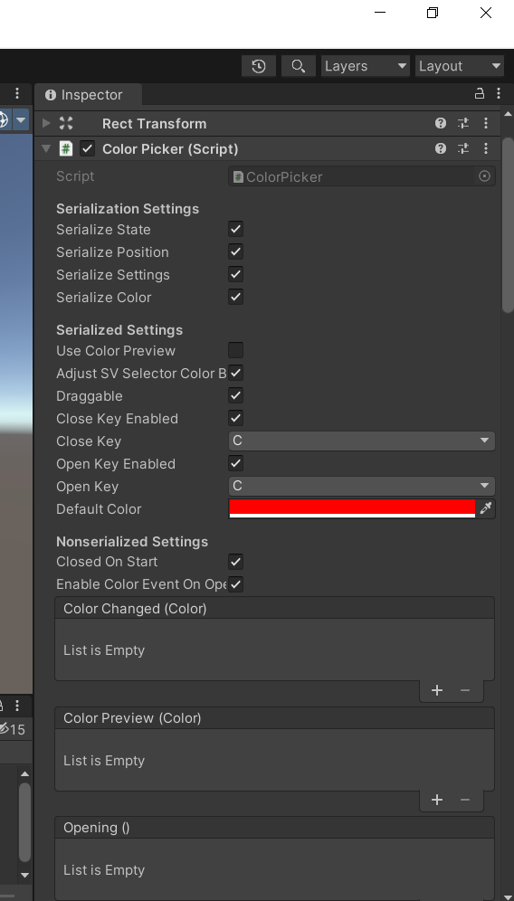
</p>


<p align="left" width="100%">
    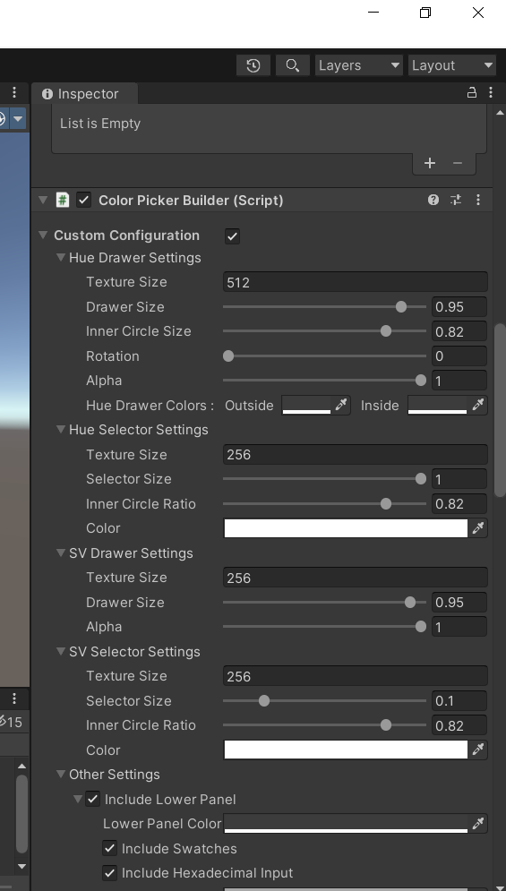
</p>

ColorPickerBuilder inspector could seem frustrating at first since it's a little long, but no worries! Most of it is for changing the color and size of UI parts which is the reason why it's a little long.

First there are customization options for the color wheel parts : 

1. Hue Drawer : That is the outermost colored wheel. It represents the hue values in the HSV color space
2. Hue Selector : That is the small circle on the Hue Drawer, and it's responsible for selecting the hue component of the color
3. SV (Saturation-Value) Drawer : That is the square in the middle, it draws the corresponding colors (by drawing all the saturation and value pairs) for the given hue value
4. SV (Saturation-Value) Selector : That is the small circle on the SV Drawer. It selects the final color

<p align="left" width="100%">
    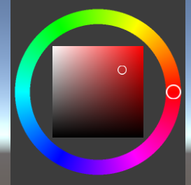
</p>

Here are the customizations you can make on the wheel : 

* Hue Drawer Settings
    * Texture Size : Size of the texture drawn. Since this is only drawn in the editor and is an essential part of the color picker, you can get away with a big texture size but it won't probably make much difference and making it too big will still dramatically increase the build times. Powers of 2 are recommended
    * Drawer Size : This is a value between 0.5 and 1, and it changes the radius of the Hue Drawer
    * Inner Circle Size : This is a value between 0 and 0.95 and it changes the radius of the inner circle of the Hue Drawer, which is inversely proportional to its thickness
    * Rotation : This is a value between 0 and 360 and it changes the rotation of the Hue Drawer (it rotates the colors). This is only a visual event and does not reduce or increase the color space in any way
    * Alpha : This is a value between 0 and 1 and it changes the opacity of the Hue Drawer. It's best to keep it at 1
    * Hue Drawer Colors : These are the colors drawn inside and outside the Hue Drawer
* Hue Selector Settings
    * Texture Size : Size of the texture drawn relative to Hue Drawer. Since this is only drawn in the editor, you can get away with a big texture size but it won't probably make much difference and making it too big will still dramatically increase the build times
    * Selector Size : This is a value between 0.1 and 1, it changes the radius of the Hue Selector
    * Inner Circle Size : This is a value between 0 and 0.95 and it changes the radius of the inner circle of the Hue Selector, which is inversely proportional to its thickness
    * Color : The color of the Hue Selector. It's a good idea to pick a color that'll be visible throughout the color wheel.
* SV Drawer Settings
    * Texture Size : Size of the texture drawn. Since the texture will be drawn everytime hue changes, it is recommended to keep this value small. Powers of 2 are recommended
    * Drawer Size : This is the size of the SV Drawer relative to the Hue Drawer, it changes between 0.1 and 1
    * Alpha : This is a value between 0 and 1 and it changes the opacity of the SV Drawer. It's best to keep it at 1
* SV Selector Settings
    * Texture Size : Size of the texture drawn. Since this is only drawn in the editor, you can get away with a big texture size but it won't probably make much difference and making it too big will still dramatically increase the build times
    * Selector Size : Size of the SV Selector relative to the SV Drawer, it can be set between 0.01 and 0.5
    * Inner Circle Size : This is a value between 0 and 0.95 and it changes the radius of the inner circle of the SV Selector, which is inversely proportional to its thickness
    * Color : The color of the Hue Selector


These are all the customization options there is for the color wheel part, the next part is Other Settings, this part includes settings for the other panels. You can enable/disable features and include/exclude parts of the Color Picker UI from these settings.

<p align="left" width="100%">
    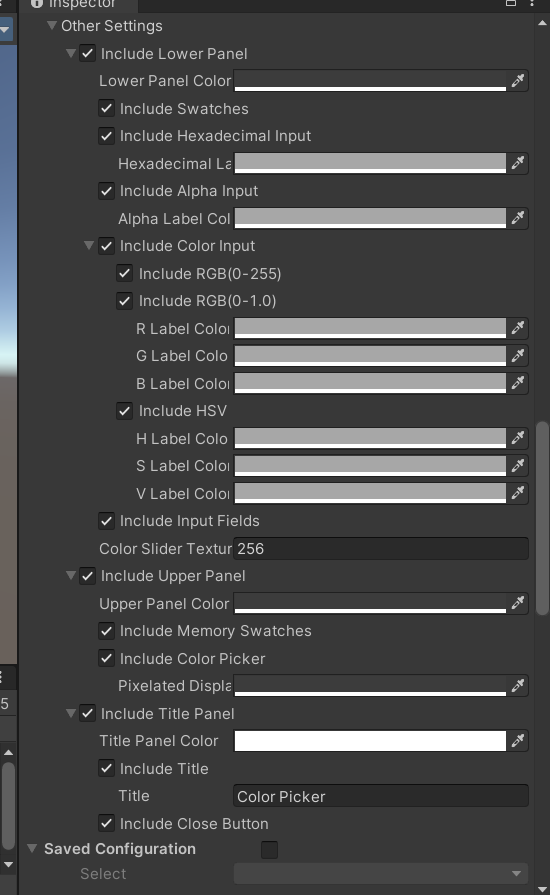
</p>

* Include Lower Panel : The option to include/exclude the lower panel with all features within it
    * Lower Panel Color : The background color of the lower panel
    * Include Swatches : The option to include/exclude swatches
    * Include Hexadecimal Input : The option to include/exclude hexadecimal input
        * Hexadecimal Label Color
    * Include Alpha Input : The option to include/exclude alpha input
        * Alpha Label Color
    * Include Color Input : The option to include/exclude color input (color sliders and input fields except alpha and hexadecimal inputs)
        * Include RGB(0-255) : The option to include/exclude RGB 0-255 color mode
        * Include RGB(0-1.0) : The option to include/exclude RGB 0-1 color mode
            * R Label Color
            * G Label Color
            * B Label Color
        * Include HSV : The option to include/exclude HSV color mode
            * H Label Color
            * S Label Color
            * V Label Color
    * Include Input Fields : The option to include/exclude all color input fields except for hexadecimal input
    * Color Slider Texture : Size of the texture drawn on color sliders. Since the texture will be drawn everytime color changes, it is recommended to keep this value small.
* Include Upper Panel : The option to include/exclude the upper panel with all features within it
    * Upper Panel Color : The background color of the upper panel
    * Include Memory Swatches : The option to include/exclude memory swatches
    * Include Color Picker : The option to include/exclude screen color picker (eyedropper)
        * Pixelated Display Background Color : The background color of the pixelated display (the zoomed display of the eyedropper)
* Include Title Panel : The option to include/exclude the title panel with all features within it
    * Title Panel Color : The background color of the title panel
    * Include Title : The option to include/exclude title text
        * Title : The title text
    * Include Close Button : The option to include/exclude close button

All of the settings above are contained within a foldout group named Custom Configurations, there's also a second foldout named Saved Configurations. Saved Configurations foldout lets you save your custom configurations ny name and later on build them back again easily.

<p align="left" width="100%">
    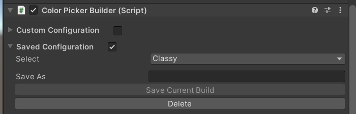
</p>


1. You can select a saved configuration via the dropdown menu,
2. Save a configuration by entering the wished name to the input field and clicking Save Current Build,
3. Delete the selected configuration by clicking the Delete button

Note that when you save a configuration, it doesn't save your non-applied changes.

Configurations are usually stored in a folder named Configurations that's in the InGameColorPicker folder, however if the name of the root folder is changed they can be stored directly under the Assets directory.

You can go to configurations and learn about the data stored in them. Here's how a configuration looks like : 

<p align="left" width="100%">
    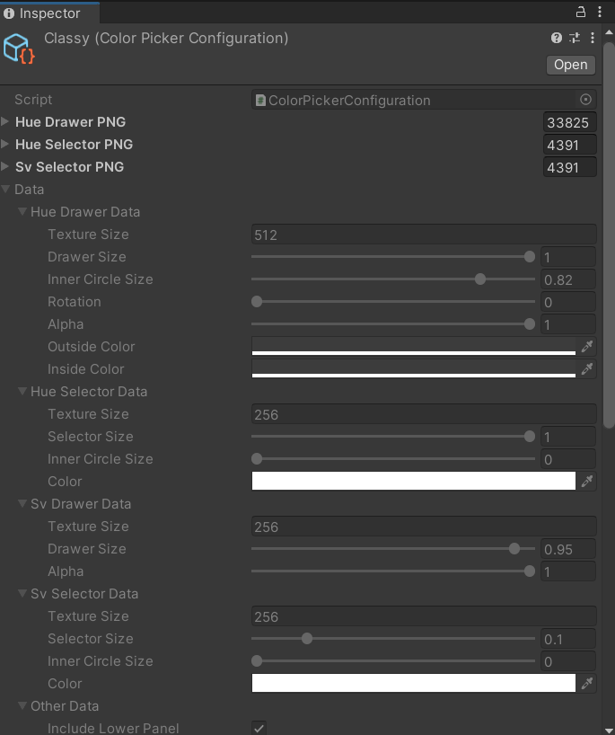
</p>

Up to this point, you've either created a custom configuration or selected from the configurations you've saved before. But none of the changes are applied to your Color Picker yet. To apply the changes, you have to click the button "Build" (if there are no changes then it will be disabled). If you click the button "Revert" then it will delete the changes made in the inspector so you can see the current values again. The "Default" button builds the default configuration.

<p align="left" width="100%">
    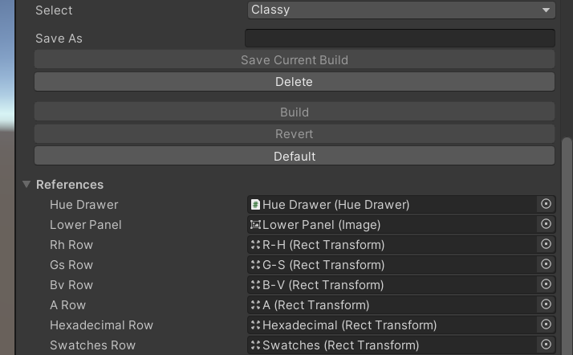
</p>

Below these buttons are the references to parts of the UI for the ColorPickerBuilder to function, and you don't have to worry about them.

2. ### ColorPicker

Now that you've setup your Color Picker's apperance and some other things in ColorPickerBuilder, you can scroll back up to ColorPicker script's inspector and start setting it up. The variables and settings in the ColorPicker define how the Color Picker will behave in certain scenarios and how it will fire events and which data will be persisted to next gameplay sessions.

There are 3 categories of settings under ColorPicker;

1. Serialization settings : Defines which data will be serialized and persisted.
2. Serializable (Serialized) Settings : These are the settings that are serialized and hence can be changed in runtime, they allow you to create a settings screen for your user (That's if Serialize Settings is true)
3. Nonserialized Settings : These are the settings that can only be set through the inspector and will not be serialized and hence will not be persisted to next game sessions if changed during execution.


<p align="left" width="100%">
    
</p>


1. Serialization Settings
    * Serialize State : The option to serialize the state of swatches panel (whether it was expanded or not, and whether it was in grid mode or vertical mode) and color mode dropdown (the current color mode)
    * Serialize Position : The option to serialize the position of the color picker
    * Serialize Settings : The option to serialize serializable settings
    * Serialize Color : The option to serialize the current color
2. Serialized Settings
    * Use Color Preview : When turned on, the Color Preview event will be fired whenever the color is changed and the Color Changed event will only be fired when the Color Picker is closed; When turned off, the Color Changed and Color Preview events will be fires when the color is changed, and no events will be fires when the color picker is closed
    * Adjust SV Selector Color Based On Brightness : When turned on, the color of the SV Selector will be adjusted based on the brightness underneath it (SV Drawer) so that it'll be more visible (Be warned that this might cause weird/unpleasant colors depending on the color of the SV Selector)
    * Draggable : When turned on, the color picker will be draggable via the upper and title panels
    * Close Key Enabled : Enables the closing key
    * Close Key : The key to close the color picker instance (works only when Close Key Enabled is true)
    * Open Key Enabled : Enables the opening key
    * Open Key : The key to open the color picker instance (works only when Open Key Enabled is true)
    * Default Color : This is the default color the color picker will instantiate with (unless the color is serialized)
3. Nonserialized Settings
    * Closed On Start : When turned on, the color picker will close itself on start after instantiation (caution : the color picker has to be open(enabled) before going to play mode to be able to instantiate itself correctly)
    * Enable Color Event On Opening : When turned on, a color event will be fired on opening (so that the object that's subscribed to the event will react when the color picker is opened)


Up to this point, you've setup everything and now are ready to use the color picker. You can subscribe to the events the color picker provides and implement your logic.


<p align="left" width="100%">
    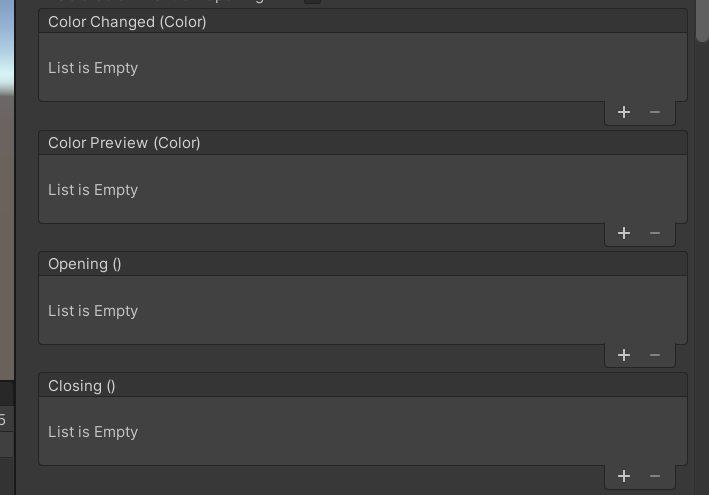
</p>

* ColorChanged : If the setting "Use Color Preview" is turned on, this event will be fires only when the color picker is closed, otherwise it'll be fired whenever the color is changed
* ColorPreview : This event is fired only when the color picker is open, and "Use Color Preview" is turned on
* Opening : This event is fired when the color picker is opening
* Closing : This event is fired when the color picker is closing

Since these are Unity events you can either subscribe to them through the inspector or by code, here's how to subscribe to them through the editor : 

<p align="left" width="100%">
    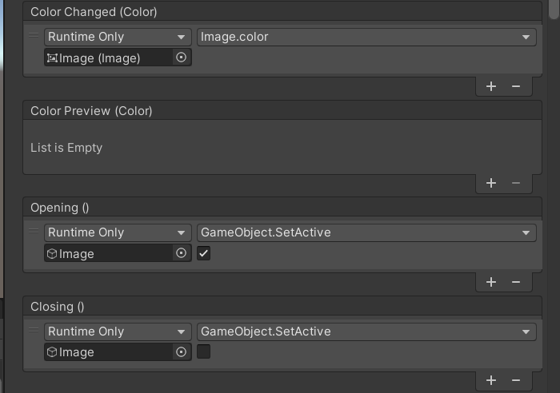
</p>

And here's a sample code that subscribes to the events : 

```csharp
using UnityEngine;
using UnityEngine.UI;
using Xenia.ColorPicker;

public class DemoScript : MonoBehaviour
{
    [SerializeField] ColorPicker colorPicker;
    [SerializeField] Image targetImage;

    private void Awake()
    {
        colorPicker.ColorChanged.AddListener((Color c) => targetImage.color = c);
        colorPicker.ColorPreview.AddListener((Color c) => Debug.Log($"Previewing {c}"));
        colorPicker.Opening.AddListener(Open);
        colorPicker.Closing.AddListener(Close);
    }

    private void Open()
    {
        gameObject.SetActive(true);
    }

    private void Close()
    {
        gameObject.SetActive(false);
    }
}
```

3. ### More About The API

ColorPicker script has some useful properties and methods besides the events, here's a list of them : 

1. Properties
    * CurrentColor : You can get and set the current color with this property, be warned that the color events will not be fired unless you call ```FireEvents()``` after assigning the color
    * Serialized Settings Properties : You can change the values of these settings with these properties in runtime
        * UseColorPreview
        * AdjustSVSelectorColorBasedOnBrightness
        * Draggable
        * CloseKeyEnabled
        * CloseKey
        * OpenKeyEnabled
        * OpenKey
2. Methods
    * ```csharp
        /*You can also assign colors using this method, you have to call FireEvents() after assigning the color if you want
        the subscribed objects to be notified of the color change*/
        public void AssignColor(Color color);
      ```
    * ```csharp
        /*Use this method to assign colors if you only want to change one component like 'R = 255' but keep the rest of the components same */
        public void AssignColor(float r = -1f, float g = -1f, float b = -1f, float a = -1f);
      ```
    * ```csharp
        //Call this method after changing the color through code if you want the subscribed objects to be notified
        public void FireEvents();
      ```
    * ```csharp
        //Opens the color picker
        public void Open();
      ```
    * ```csharp
        //Opens the color picker on top of the world point
        public void OpenAtWorldPoint(Vector3 worldPoint, Camera cam = null);
      ```
    * ```csharp
        //Opens the color picker at the screen point
        public void OpenAtScreenPoint(Vector2 screenPoint)
      ```
    * ```csharp
        //Closes the color picker
        public void Close();
      ```

## Other Information

1. Serialization Directory : Application.persistentDataPath + "/ColorPicker"
2. If you're not using certain parts of the UI you can delete them, however you can not rebuild the color picker after deleting these parts. In that case you have to cretae a new instance
3. If you change a serialized setting after going into play mode once, then the old setting will be reassinged to the color picker in playmode. In that case you can go to serialization directory and clear everything or change the setting in playmode too.

## Authors

- [@XeniaPhe](https://github.com/XeniaPhe)
